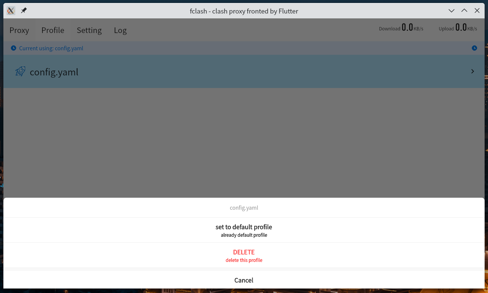
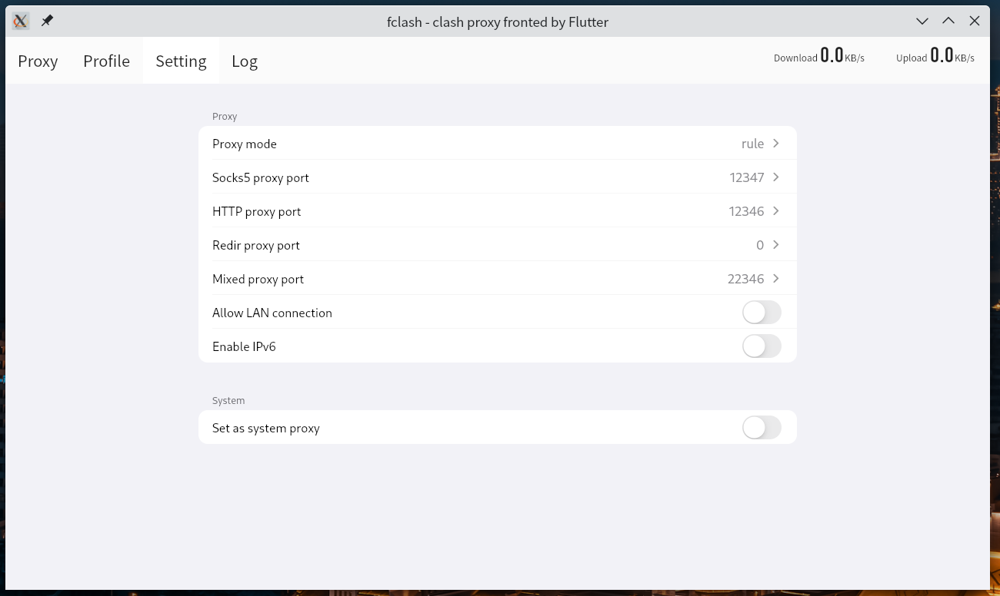
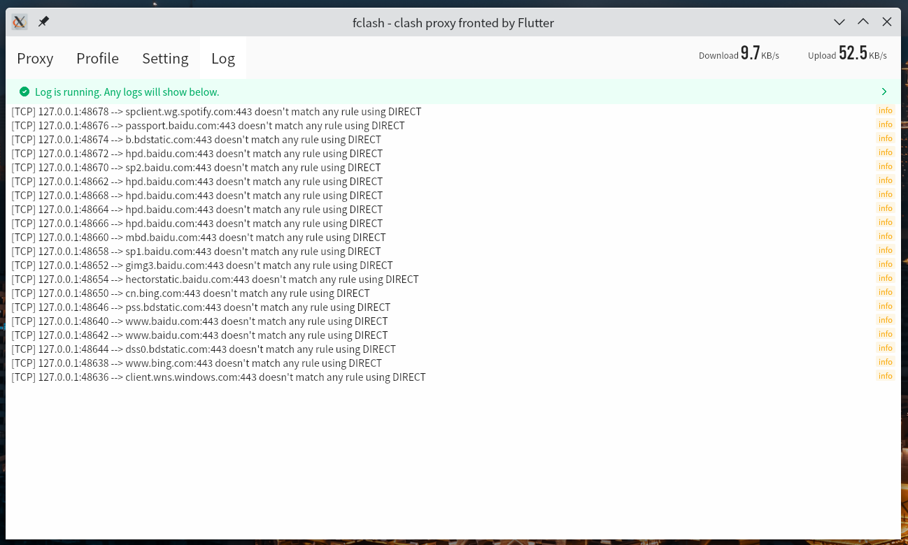
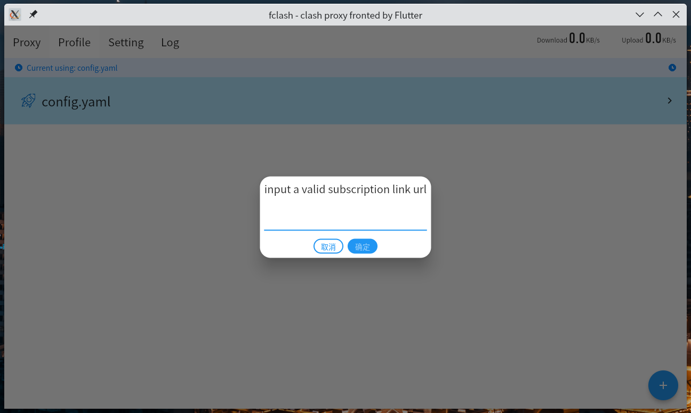
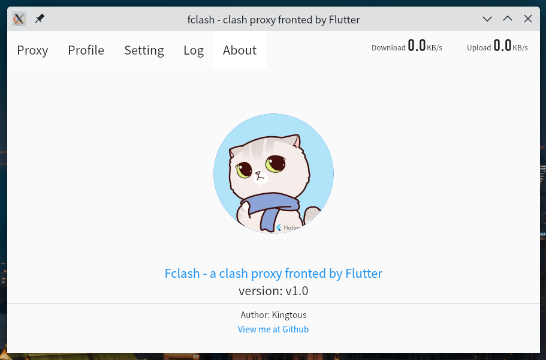
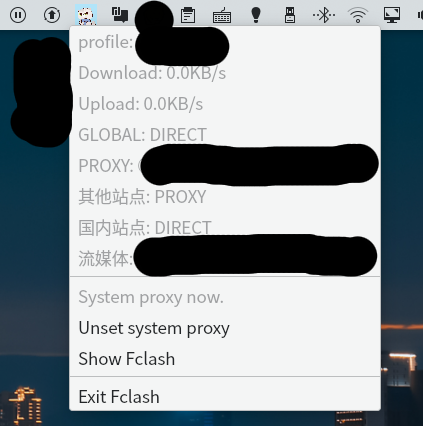

# FClash

A Clash Proxy Fronted based on Clash

Linux Supported

## Feature

- Stable: Restart and restore clash status when clash kernel crashs automatically.
- Stable: Monitor Realtime runtime status.
- UI: Beautiful UI built by Flutter.
- UI: Chinese/English localizations supported.
- Functions: Easy to set/unset as system proxy.
- Functions: Full customized setting, proxy mode, ports, LAN connection, ipv6, etc.
- Functions: Switch yaml configs in realtime.
- Functions: Test delay with each proxy.
- Functions: prebuilt clash kernel and country mmdb.
- Info: Show status on status menu bar.
- Info: Show logs on About page.
- Info: Show download/upload rates on both system app menu bar and in-app menu bar.

## Preview

- Proxy Page
  

- Profile Page
  

- Setting Page
  

- Logs Page
  

- Add a subscription page
  

- About Page
  

- App system menu bar
  

## Install

- Snap Store(comming soon)
  - `sudo snap install fclash --classic`

- Download binary files, go to [Github Action page](https://github.com/Kingtous/Fclash/actions).

## Build from source

FClash depends `libappindicatior3-dev` when compiling.